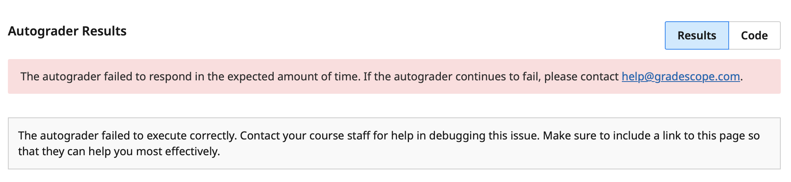
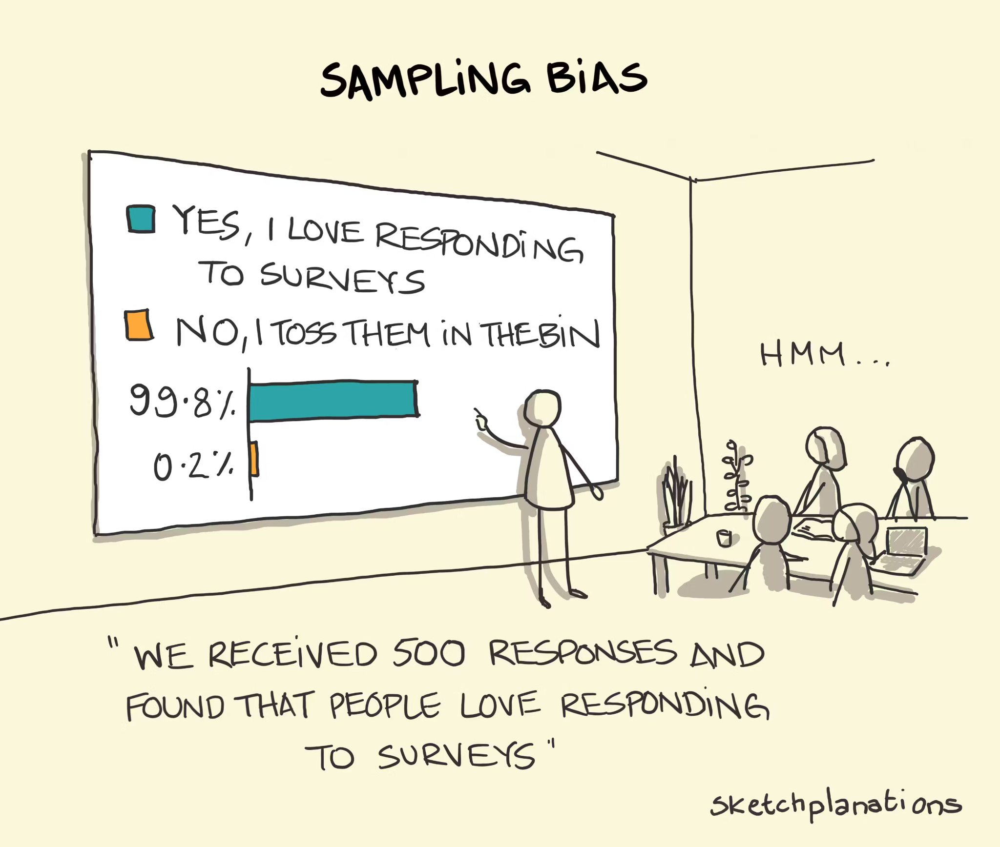
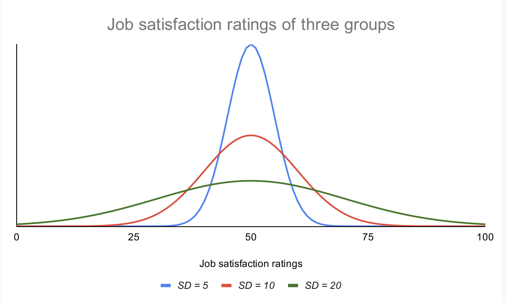
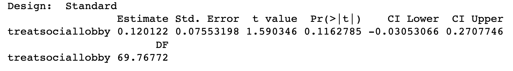
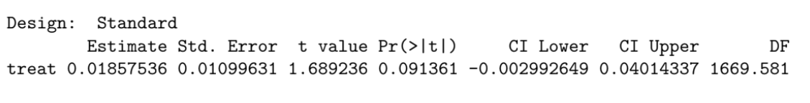

```{r setup, include=FALSE}
knitr::opts_chunk$set(echo = TRUE, eval = TRUE, comment = "#>", size = "small")

# Change this filename each week to that week's QR code image.
# Just drop the image file in the same folder as this .Rmd.
qr_image <- "qr-code-4.png"
```

## Agenda

1. Bias vs. Noise
2. Standard Errors
3. P-Values
4. Practice Exercise

## Reminders

- Problem Set 1 due today (Friday) at midnight
   - Verify you submitted the right assignment. I have started grading some and some of them are a in-class assignment

- Project Proposal due Monday at midnight

- Midterm signup will go out Monday morning

## Gradescope Error

If you ever see this error on a gradescope submission, do not hesitate to email. It is because the autograder failed for some reason and I can have it rerun.

```{r, fig.align="center", out.width="100%", echo=FALSE}

```

## Research Proposal Feedback

Is the research question clear?

\vspace{2em}

Is it easy to tell if it is a causal/descriptive question?

\vspace{2em}

Is the data you are planning to collect well suited to answer the question?

## Measuring Uncertainty

Discuss:

\begin{enumerate}
\item \textcolor{blue}{Why do we care about measuring the uncertainty of an estimate? In other words, why just the difference in means not enough to make conclusions about the effect of a treatment?}
\vspace{1em}
\item \textcolor{blue}{What is the difference between noise and bias?}
\end{enumerate}


##

```{r, fig.align="center", out.width="85%", echo=FALSE}

```

## Bias

- Bias is a systematic deviation from the truth
- You can think of bias as a consistent inaccuracy
- You've already seen bias!
- Similar to bias in a colloquial sense:
    - If the judicial system is racially biased, it will be consistently discriminatory
    - If I have a biased point of view, I will automatically come to the same conclusion regardless of the evidence you present to me
    - If we have a biased way of researching our topic of interest, we will end up at the same (wrong) conclusion

## Noise

- Noise is simply the random difference between samples
- Noise is inevitable when sampling -- we don't have the true population

## Bias vs. Noise

Bias can also be thought of as Inaccuracy

Noise can be thought of as Imprecision

\begin{figure}
    \centering
    % Target 1: Low Bias, Low Noise
    \begin{subfigure}[b]{0.23\textwidth}
        \centering
        \begin{tikzpicture}[scale=0.38, transform shape]
            \fill[targetred] (0,0) circle (2cm);
            \fill[white] (0,0) circle (1.3cm);
            \fill[targetred] (0,0) circle (0.6cm);
            \tikzset{cross/.pic = {
                \draw[line width=1.5pt] (-0.12,-0.12) -- (0.12,0.12);
                \draw[line width=1.5pt] (-0.12,0.12) -- (0.12,-0.12);
            }}
            \pic at (0, 0.25) {cross};
            \pic at (-0.25, 0.05) {cross};
            \pic at (0.25, 0.1) {cross};
            \pic at (-0.15, -0.2) {cross};
            \pic at (0.15, -0.3) {cross};
        \end{tikzpicture}
        \caption*{Low Bias\\Low Noise}
        \label{fig:low_bias_low_noise}
    \end{subfigure}
    \hfill
    % Target 2: Low Bias, High Noise
    \begin{subfigure}[b]{0.23\textwidth}
        \centering
        \begin{tikzpicture}[scale=0.38, transform shape]
            \fill[targetred] (0,0) circle (2cm);
            \fill[white] (0,0) circle (1.3cm);
            \fill[targetred] (0,0) circle (0.6cm);
            \tikzset{cross/.pic = {
                \draw[line width=1.5pt] (-0.12,-0.12) -- (0.12,0.12);
                \draw[line width=1.5pt] (-0.12,0.12) -- (0.12,-0.12);
            }}
            \pic at (0.1, -0.1) {cross};
            \pic at (-0.6, 0.9) {cross};
            \pic at (1.6, 0.6) {cross};
            \pic at (-1.4, -1.2) {cross};
            \pic at (0.7, -0.8) {cross};
        \end{tikzpicture}
        \caption*{Low Bias\\High Noise}
        \label{fig:low_bias_high_noise}
    \end{subfigure}
    \hfill
    % Target 3: High Bias, Low Noise
    \begin{subfigure}[b]{0.23\textwidth}
        \centering
        \begin{tikzpicture}[scale=0.38, transform shape]
            \fill[targetred] (0,0) circle (2cm);
            \fill[white] (0,0) circle (1.3cm);
            \fill[targetred] (0,0) circle (0.6cm);
            \tikzset{cross/.pic = {
                \draw[line width=1.5pt] (-0.12,-0.12) -- (0.12,0.12);
                \draw[line width=1.5pt] (-0.12,0.12) -- (0.12,-0.12);
            }}
            \pic at (-1.2, -0.9) {cross};
            \pic at (-0.9, -1.2) {cross};
            \pic at (-1.1, -1.4) {cross};
            \pic at (-1.4, -1.1) {cross};
            \pic at (-1.3, -1.5) {cross};
        \end{tikzpicture}
        \caption*{High Bias\\Low Noise}
        \label{fig:high_bias_low_noise}
    \end{subfigure}
    \hfill
    % Target 4: High Bias, High Noise
    \begin{subfigure}[b]{0.23\textwidth}
        \centering
        \begin{tikzpicture}[scale=0.38, transform shape]
            \fill[targetred] (0,0) circle (2cm);
            \fill[white] (0,0) circle (1.3cm);
            \fill[targetred] (0,0) circle (0.6cm);
            \tikzset{cross/.pic = {
                \draw[line width=1.5pt] (-0.12,-0.12) -- (0.12,0.12);
                \draw[line width=1.5pt] (-0.12,0.12) -- (0.12,-0.12);
            }}
            \pic at (0, -0.2) {cross};
            \pic at (-1.7, 0.1) {cross};
            \pic at (-1.6, -0.9) {cross};
            \pic at (-0.8, -1.7) {cross};
            \pic at (0.2, -1.8) {cross};
        \end{tikzpicture}
        \caption*{High Bias\\High Noise}
        \label{fig:high_bias_high_noise}
    \end{subfigure}
\end{figure}


## 1. Standard Deviation

A measure of "spread" -- summary of how much a set of values are away from the mean


The formula is:
$$
\text{SD} = \sqrt{ \frac{\sum (x - \bar{x})^2}{n-1}}
$$


## Standard Deviation

```{r, fig.align="center", out.width="100%", echo=FALSE}

```

## 2. Standard Error

- If we took a bunch of samples and measured a value for each, the standard error is the standard deviation of those values.
- In other words, standard error is a measure of how much we'd expect our findings to vary if we could replicate our study thousands of times
- Therefore, the standard error helps us measure how much we'd expect the estimate from the experiment to differ from the truth (the real effect) by chance
- It is a measure of noise, not bias

## Standard Error and other sample statistics

$$
\text{Standard Error} = \sqrt{\frac{s^2_1}{n_1} + \frac{s^2_2}{n_2}}
$$

- $n$ = Sample size (i.e., number of observations)
- $s$ = Sample standard deviation
- $s_{\bar{x}}$ = Estimated standard error of the mean ($s/\sqrt{n}$)


## Standard Error other sample statistics

$$
\text{Standard Error} = \sqrt{\frac{s^2_1}{n_1} + \frac{s^2_2}{n_2}}
$$

- It can only be positive
- \textcolor{blue}{What do you think happens to the SE as $s$ or $n$ increases?}

\pause

As $s$ increases, the standard error will increase as well. As the spread of the population gets bigger (standard deviation), the actual sample that we get from it will also grow.


## 3. t-statistic

$$t = \frac{\text{Estimate}}{\text{Standard Error}}$$

- **t-statistic:** to measure how likely that an estimate of the size we saw would arise by chance, even if the treatment had no effect.
- **Estimate:** our best guess of what the true ATE is.
- If $t > 1.96$ or $t < -1.96$, the observed result is **statistically significant** (more next week).

```{r, fig.align="center", out.width="100%", echo=FALSE}

```

## t-statistic: Why 1.96? {.fragile}

\begin{center}
\begin{tikzpicture}
\begin{axis}[
  no markers,
  domain=-4:4,
  samples=200,
  axis x line=bottom,
  height=6.5cm,
  width=11.5cm,
  xmin=-4.2, xmax=4.2,
  ymin=0, ymax=0.43,
  clip=false,
  xtick={-4,-3,-2,-1,0,1,2,3,4},
  xticklabels={$-4\sigma$,$-3\sigma$,$-2\sigma$,$-1\sigma$,$0$,$1\sigma$,$2\sigma$,$3\sigma$,$4\sigma$},
  ticklabel style={font=\fontsize{7pt}{8pt}\selectfont\color{gray}},
  axis line style={curveblue, thick},
  hide y axis
]

  % Define Gaussian function
  \pgfmathdeclarefunction{gauss}{2}{%
    \pgfmathparse{1/(#2*sqrt(2*pi))*exp(-((x-#1)^2)/(2*#2^2))}%
  }

  % Fill Regions
  \addplot [fill=purplefill, draw=none, domain=-4:-3] {gauss(0,1)} \closedcycle;
  \addplot [fill=purplefill, draw=none, domain=3:4] {gauss(0,1)} \closedcycle;
  \addplot [fill=purplefill, draw=none, domain=-3:-2] {gauss(0,1)} \closedcycle;
  \addplot [fill=purplefill, draw=none, domain=2:3] {gauss(0,1)} \closedcycle;
  \addplot [fill=pinkfill, draw=none, domain=-2:-1] {gauss(0,1)} \closedcycle;
  \addplot [fill=pinkfill, draw=none, domain=1:2] {gauss(0,1)} \closedcycle;
  \addplot [fill=cyanfill, draw=none, domain=-1:1] {gauss(0,1)} \closedcycle;

  % Vertical Boundary Lines
  \draw [cyangreen, semithick] (axis cs:0,0) -- (axis cs:0, 0.3989);
  \draw [cyangreen, semithick] (axis cs:-1,0) -- (axis cs:-1, 0.2420);
  \draw [cyangreen, semithick] (axis cs:1,0) -- (axis cs:1, 0.2420);
  \draw [pinkred, semithick] (axis cs:-2,0) -- (axis cs:-2, 0.0540);
  \draw [pinkred, semithick] (axis cs:2,0) -- (axis cs:2, 0.0540);
  \draw [purpletext, semithick] (axis cs:-3,0) -- (axis cs:-3, 0.0044);
  \draw [purpletext, semithick] (axis cs:3,0) -- (axis cs:3, 0.0044);

  % Bell Curve Line
  \addplot [curveblue, thick, domain=-4:4] {gauss(0,1)};

  % Percentage Labels (Adjust point sizes here: \fontsize{FONT_SIZE}{LINE_SPACING}\selectfont)
  \node [font=\fontsize{7.5pt}{9pt}\selectfont\bfseries, color=cyangreen] at (axis cs:-0.5, 0.15) {34.13\%};
  \node [font=\fontsize{7.5pt}{9pt}\selectfont\bfseries, color=cyangreen] at (axis cs:0.5, 0.15) {34.13\%};
  \node [font=\fontsize{7.5pt}{9pt}\selectfont\bfseries, color=pinkred] at (axis cs:-1.5, 0.035) {13.59\%};
  \node [font=\fontsize{7.5pt}{9pt}\selectfont\bfseries, color=pinkred] at (axis cs:1.5, 0.035) {13.59\%};
  \node [font=\fontsize{7.5pt}{9pt}\selectfont\bfseries, color=purpletext] at (axis cs:-2.5, 0.05) {2.14\%};
  \node [font=\fontsize{7.5pt}{9pt}\selectfont\bfseries, color=purpletext] at (axis cs:2.5, 0.05) {2.14\%};

  % 95% Confidence Interval Line Below X-Axis
  \draw [thick, curveblue] (axis cs:-1.96, -0.07) -- (axis cs:1.96, -0.07);
  \draw [thick, curveblue] (axis cs:-1.96, -0.055) -- (axis cs:-1.96, -0.085);
  \draw [thick, curveblue] (axis cs:1.96, -0.055) -- (axis cs:1.96, -0.085);
  \node [font=\fontsize{7.5pt}{9pt}\selectfont\bfseries, color=curveblue, below] at (axis cs:0, -0.07) {95\% of data ($\pm 1.96\sigma$)};

\end{axis}
\end{tikzpicture}
\end{center}}


## Interpreting T-Statistics

```{r, fig.align="center", out.width="100%", echo=FALSE}

```

\small
0.01857536 / 0.01099631 = 1.689236

**A small estimate relative to a large standard error will result in a small t-statistic (and less confidence in the estimate being different from zero).**

## Hypothesis Testing

\small

- In science we test hypotheses
    - Ex: Autocracies are more likely than democracies to go to war
- The **null hypothesis** is our default: what the world would look like if we did not observe the effect we are interested in finding
    - Ex: Autocracies and democracies are equally likely to go to war
- The **alternative hypothesis** reflects what we would observe if there was, actually, a true effect in the world
    - Ex: Autocracies and democracies are not equally likely to go to war
- We never prove one hypothesis or the other
    - Because of noise (i.e. sampling), we can never be sure we're observing the truth
    - But we can measure how likely we'd be to observe the effect we see by chance

## P-Values

\small

- What's the probability that we would observe the effect we see by chance?
    - A p-value of 0.13 means that there is a 13% probability that we would observe the effect we see even if the null hypothesis was true
- We want to maximize our confidence that we are NOT observing the effect by chance
    - A p-value of greater than (or equal to) 0.05 is considered statistically insignificant
    - A p-value of less than 0.05 is statistically significant
        - We are less than 5% likely to observe this effect by chance!
        - OR: We are more than 95% likely to not be observing this effect by chance!
- This gives us evidence in support of the alternative hypothesis but does not prove it

## Interpreting P-Values

```{r, fig.align="center", out.width="100%", echo=FALSE}

```

- The treatment increases the outcome by about 1.9 percentage-points relative to the control.
- However, we would expect this result (or something smaller) to occur roughly 9% of the time if this effect was driven entirely by chance.


```{r attendance, results='asis', echo=FALSE}
if (params$show_answers) {
  cat(paste0("
## Attendance Survey

\\begin{center}
\\includegraphics[width=0.45\\textwidth]{", qr_image, "}
\\end{center}
"))
}
```

## Exercises

I have created a practice exercise for you to work through to give you more practice with `R` and a chance to determine the steps yourself and then implement it.

\textbf{It is intended to be harder than the in-class assignments so don't be discouraged.}

Go to the bCourses page $\rightarrow$ Section 6 $\rightarrow$ Week 6 Section Exercise

\vspace{3em}

I also have created \textit{optional} exercises that will teach you more `R` beyond what the class will cover. If you would prefer, you can also use this time to work on that.


## Acknowledgements

Special thanks to prior GSIs, Will Halm, and Tess Louie for providing materials off of which some of these slides are based.

