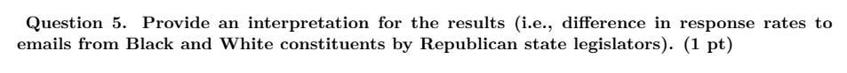
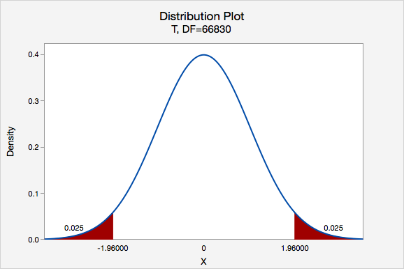
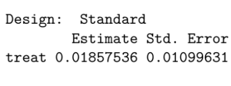
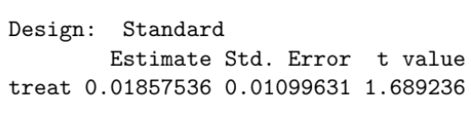
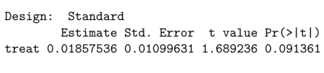
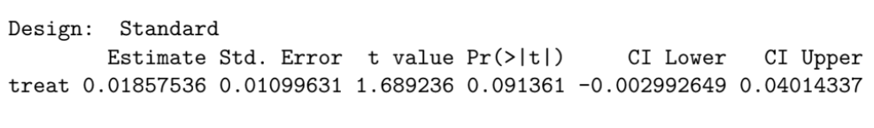

```{r setup, include=FALSE}
knitr::opts_chunk$set(echo = FALSE)
```

## Attendance Survey

**Fill out before the end of section!**

<https://forms.gle/1kCBpom7MXxb9gDv6>

```{r, out.height="0.4\\textheight", fig.align="center"}
knitr::include_graphics("images/qr_attendance.png")
```

::: notes
Put at the end of the slides too
:::

## Agenda

1. Attendance Survey
2. Interpreting Data
3. Midterm Review
4. Reviewing P-Values
5. Confidence Intervals

## Housekeeping

- Problem Set Grading
    - We will finish grading in the next few days or so
- Project Proposals due
    - Follow the rubric!
- Problem Set #2 due next Friday by 11:59 pm.
- Midterm coming up two weeks from now
    - Study guide on bCourses
    - If you're worried about your overall grade, see me!

## How to Interpret Data

\small

- Only say what the data literally say
    - Ex: interpret the treatment effect within the context of the experiment, interpret the p-value, t-statistic, confidence intervals, etc. --- whatever is relevant to answering the question
    - And put it back into the context of the question!
- Consider how confident we can be in our results
    - Sources of bias
        - Omitted variable bias, selection bias, reverse causation
    - Sources (and measures) of noise
        - Randomization
        - Standard errors, t-statistics, p-values, confidence intervals
- If asked, provide a hypothetical alternative explanation or extrapolation from the data
    - Why might the data look the way they do?
    - Ex: this finding could be evidence of racial discrimination

## Interpreting Data

```{r, out.width="\\textwidth", fig.align="center"}

```

\small
**ANSWER:** Given the same request, Republican state legislators were, on average, about 8 percentage points less likely to respond to the Black Deshawn alias than to the White Jake alias.

- Uses the answer from the previous question
- Emphasizes that each treatment was the same except for one randomized difference (alias/race).
- Identifies an **average** treatment effect
- Contextualizes the interpretation in the study (Black vs. White alias)
- Does not extrapolate from the data

## Interpreting Data

```{r, out.width="\\textwidth", fig.align="center"}
knitr::include_graphics(c("images/q14_prompt.png"))
```

\vspace{1em}

```{r, out.width="\\textwidth", fig.align="center"}
knitr::include_graphics(c("images/q14_solution.png"))
```

## Midterm Review: Fill in the Blanks

\footnotesize

- \_\_\_\_\_ is when the way you collect data leads to a systematic inaccuracy in your results. One source of this could be \_\_\_\_\_\_\_\_.
- \_\_\_\_\_ is the random difference that occurs across our samples.
- Standard errors can be [negative only | positive only | only between 0 and 1].
- A \_ statistic tells us how likely it is our observed effect would have arisen by chance. It can be [positive only | positive or negative]. We consider our estimate to be statistically significant if the \_ statistic is [how large?].
- A \_ value tells us how likely we'd view the effect we see in our sample if it happened randomly, aka if our treatment had [some | no] effect. It can be [negative only | positive or negative | between 0 and 1]. We consider our estimate to be statistically significant if the \_ value is less than \_\_\_\_\_\_.
- The \_\_\_\_ hypothesis is what we'd imagine would happen if our treatment had no effect. The \_\_\_\_ hypothesis is what we'd imagine if our treatment had some effect. We [prove one hypothesis | provide support for one hypothesis].

## Midterm Review: Fill in the Blanks

\footnotesize

- **Bias** is when the way you collect data leads to a systematic inaccuracy in your results. One source of this could be [omitted variable bias | reverse causation | selection bias | sampling bias].
- **Noise** is the random difference that occurs across our samples.
- Standard errors can be **any positive value**.
- A **t** statistic tells us how likely it is our observed effect would have arisen by chance. It can be **positive or negative**. We consider our estimate to be statistically significant if the t statistic is **greater than 1.96 or less than -1.96**.
- A **p** value tells us how likely we'd view the effect we see in our sample if it happened randomly, aka if our treatment had **no** effect. It can be **between 0 and 1** (just like any probability). We consider our estimate to be statistically significant if the p value is less than **0.05**.
- The **null** hypothesis is what we'd imagine would happen if our treatment had no effect. The **alternative** hypothesis is what we'd imagine if our treatment had some effect. We **provide support for one hypothesis**.

## The relationship between T-statistics and P-Values

```{r, out.height="0.75\\textheight", fig.align="center"}

```

## P-Values: A Refresher

- The probability we would see an estimate as large or larger as the one we did, if a skeptic were correct that the treatment had no effect.
    - Remember: we start by assuming the null is true and use p-values to see how likely it is that our data would be observed given the null
- Does **not** measure the probability the treatment has no effect.
- Does **not** measure the probability the treatment has an effect.
- Does **not** measure the probability either hypothesis is correct.
- Helps answer a skeptic of a treatment by telling them how likely it is we would see the effect estimate we did if the treatment actually had no effect.

## P-Values: Continued

\small

- If you have a **significant** p-value: this does not mean the treatment definitely has an effect. It's possible---indeed there's a 5% chance---of getting a statistically significant result even if a treatment has no effect.
    - However, by convention, we decide to simply call the skeptic disproved at this point, even though the skeptic's perspective still is possible.
- If you have an **insignificant** p-value: this does not mean that the treatment definitely does not have an effect.
    - For example, a treatment might have an effect but the sample size of an experiment might be too small (i.e., the standard error might be too large/wide) for the experiment to demonstrate the effect is due to chance. The estimate is still our best guess, even if we can't disprove a skeptic either.

## Interpreting P-Values

A few "scripts" that may be helpful:

- If the treatment really had no effect, there is a \_\_\_% chance that we'd view an estimate as large or larger as we saw from our sample.
- If the null hypothesis was true, there would be a \_\_\_% chance of viewing an estimate as large or larger as we saw from our sample.
- There is a \_\_\_% chance of viewing an estimate as large or larger as we saw from our sample if the effect we see is occurring purely by chance/coincidence.

## Example of Interpreting a P-Value

\small

A political campaign is trying to determine whether the proportion of registered voters in their district who support their candidate is significantly different from the overall national proportion of 50%. They conduct a survey by randomly sampling 1000 registered voters in their district and ask whether they support their candidate. They find that 540 out of the 1000 respondents support their candidate.

You want to test whether the proportion of registered voters in the district who support the candidate is significantly different from the national proportion of 50%, you find that the p-value for this t-test is 0.031. Based on the results of the t-test and the p-value, what can the campaign conclude about the proportion of registered voters in the district who support their candidate?

**Example Answer:** Based on our sample, the proportion of voters who support the candidate is significantly different from 50%. If the null hypothesis was true and 50% of voters supported the candidate, there would be about a 3% chance that we'd view an estimate as large or larger as we saw from our sample.

::: notes
Based on our sample, the proportion of voters who support the candidate is significantly different from 50%. If the null hypothesis was true and 50% of voters supported the candidate, there would be about a 3% chance that we'd view an estimate as large or larger as we saw from our sample.
:::

## Confidence Intervals

A confidence interval is a range of likely values for the "true" population parameter

\vspace{1em}

Imagine we took a poll for Yes votes on Prop 50.

**Sample estimate: 53%**

\vspace{1em}

If you were a campaign manager for Prop 50, would you be confident that you'll win the election based on this data?

## Confidence Intervals

A confidence interval is a range of possible values for the "true" population parameter

\vspace{1em}

Imagine we took a poll for Yes votes on Prop 50.

**Sample estimate: 53%**

**CI: [49%, 57%]**

\vspace{1em}

How about now? Do you still have the same opinion? Why or why not?

## Building Confidence Intervals

- "Confidence" refers to the process of making confidence intervals
    - If we made many intervals by taking many samples, 95% of the many intervals we create will "capture" the population parameter
- Top of CI = Estimate + (1.96 $\times$ Standard Error)
- Bottom of CI = Estimate $-$ (1.96 $\times$ Standard Error)

## Interpreting Confidence Intervals

Two "scripts" (again):

- If we were to do an experiment over and over again and calculate a 95% confidence interval for each study we run, 95% of those confidence intervals would contain the true average treatment effect.
- There is a 95% chance of our confidence interval including the true average treatment effect.

## Putting Confidence Intervals in Context

\small

- You can think of the top of the confidence interval as our most optimistic guess about the size of the treatment effect, and the bottom of the confidence interval as our most pessimistic guess.
- If the CI contains zero (or whatever the null hypothesis is), our findings are not statistically significant.
- Because our CIs are a function of our estimates and their corresponding standard errors, these elements affect how wide our CIs are and around which value they are centered
    - How do our confidence intervals change if the standard error changes?
        - As SE increases, the CI gets wider; as SE decreases, the CI gets narrower
    - How do our confidence intervals change if the estimate changes?
        - This is the center of the CI and has nothing to do with the width (unless the standard error also changes).
        - Ex: if your estimated effect was originally 5 and then doubled to 10, the new center of the CI would be 10, but its width would stay the same.

## Interpreting P-Values and CIs

```{r, out.width="0.6\\textwidth", fig.align="center"}

```

- Interpret the estimate
- Given the estimate and standard error, what can you predict about the significance of this estimate?
- Example interpretation: Assuming the treatment was randomly assigned, it is our best guess that the treatment increased the outcome by around 1.86 percentage-points.

## Interpreting P-Values and CIs

```{r, out.width="0.75\\textwidth", fig.align="center"}

```

- Interpret the t-statistic.
- Example interpretation: Because the t-value is less than 1.96, the observed effect is not statistically significant, and we cannot reject the null hypothesis.

## Interpreting P-Values and CIs

```{r, out.width="0.9\\textwidth", fig.align="center"}

```

- Interpret the p-value.
- If we were to run this experiment over and over and the treatment had no effect, we would expect to see an estimate this size or larger around 9% of the time. Though our best guess is that the treatment is increasing the outcome, we cannot reject the null hypothesis given that the p-value is greater than 0.05.

## Interpreting P-Values and CIs

```{r, out.width="\\textwidth", fig.align="center"}

```

\small

- What do the confidence intervals tell us about the likely range of true average treatment effects?
- If we were to repeat this experiment many times and construct a 95% confidence interval each time, approximately 95% of those intervals would contain the true average treatment effect.
- We are 95% confident that the true average treatment effect is between -0.003 and 0.040.
- The treatment is unlikely to have decreased the outcome by more than 0.3 percentage-points.
- The treatment is unlikely to have increased the outcome by more than 4 percentage-points.

## Recap

\small

- We test hypotheses to provide support for one vs. another
    - We never provide definitive proof for any hypothesis!
    - But p-values show us how probable our results would be if they arose due to chance and not due to a treatment effect
- T-statistics provide us with similar information to determine if our findings are statistically significant
- Confidence intervals give us a range of likely values of the true average treatment effect
    - If your p-value and t-statistic suggest an insignificant result, the confidence interval will contain zero
- A t-statistic greater than 1.96 or less than -1.96, a p-value of less than 0.05, and a CI not containing zero (or whatever the null hypothesis is)
    - We reject the null hypothesis that there is no treatment effect (or that there is no difference in the mean outcome for each group).
    - Otherwise, we fail to reject the null hypothesis.

## Attendance Survey

**Fill out before the end of section!**

<https://forms.gle/1kCBpom7MXxb9gDv6>

```{r, out.height="0.4\\textheight", fig.align="center"}
knitr::include_graphics("images/qr_attendance.png")
```

::: notes
Put at the end of the slides too
:::

## Acknowledgements

Special thanks to prior GSIs for providing materials off of which some of these slides are based, especially Rebekah Jones and Ian Castro.
