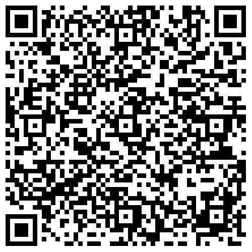

```{r setup, include=FALSE}
knitr::opts_chunk$set(echo = FALSE, comment = "")

# ---- EDIT THESE LINES once you have the lecture data -------------------
data_file <- "lecture_data.csv"   # path to the dataset used for the slide 20-23 output
# (if it is .dta use haven::read_dta(); if .rds use readRDS())
# -------------------------------------------------------------------------

data_ok <- file.exists(data_file) && requireNamespace("estimatr", quietly = TRUE)
if (data_ok) {
  library(estimatr)
  dat <- read.csv(data_file)
}
```


## Agenda

1. Example
2. P-Values
3. Midterm Review

## Housekeeping

- Decide with your group what question to ask for the Final Project
    - Survey is due October 23rd by 11:59 pm
- Problem Set #2 due next October 16th by 11:59 pm
- Midterm is October 19th-22nd
    - Study guide on bCourses
    
## Example

```{r, fig.align="center", out.width="100%", echo=FALSE}

```

## Attendance

```{r, fig.align="center", out.width="65%", echo=FALSE}

```

## How to Interpret Data

\small

- Only say what the data literally say
    - Ex: interpret the treatment effect within the context of the experiment, interpret the p-value, t-statistic, confidence intervals, etc. --- whatever is relevant to answering the question
    - And put it back into the context of the question!
- Consider how confident we can be in our results
    - Sources of bias
        - Omitted variable bias, selection bias, reverse causation
    - Sources (and measures) of noise
        - Randomization
        - Standard errors, t-statistics, p-values, confidence intervals
- If asked, provide a hypothetical alternative explanation or extrapolation from the data
    - Why might the data look the way they do?
    - Ex: this finding could be evidence of racial discrimination
    
## The relationship between T-statistics and P-Values


\begin{center}
\begin{tikzpicture}
\begin{axis}[
  no markers,
  domain=-4:4,
  samples=200,
  axis x line=bottom,
  height=6.5cm,
  width=11.5cm,
  xmin=-4.2, xmax=4.2,
  ymin=0, ymax=0.43,
  clip=false,
  xtick={-4,-3,-2,-1,0,1,2,3,4},
  xticklabels={$-4\sigma$,$-3\sigma$,$-2\sigma$,$-1\sigma$,$0$,$1\sigma$,$2\sigma$,$3\sigma$,$4\sigma$},
  ticklabel style={font=\fontsize{7pt}{8pt}\selectfont\color{gray}},
  axis line style={curveblue, thick},
  hide y axis
]

  % Fill Regions
  \addplot [fill=purplefill, draw=none, domain=-4:-3] {gauss(0,1)} \closedcycle;
  \addplot [fill=purplefill, draw=none, domain=3:4] {gauss(0,1)} \closedcycle;
  \addplot [fill=purplefill, draw=none, domain=-3:-2] {gauss(0,1)} \closedcycle;
  \addplot [fill=purplefill, draw=none, domain=2:3] {gauss(0,1)} \closedcycle;
  \addplot [fill=pinkfill, draw=none, domain=-2:-1] {gauss(0,1)} \closedcycle;
  \addplot [fill=pinkfill, draw=none, domain=1:2] {gauss(0,1)} \closedcycle;
  \addplot [fill=cyanfill, draw=none, domain=-1:1] {gauss(0,1)} \closedcycle;

  % Vertical Boundary Lines
  \draw [cyangreen, semithick] (axis cs:0,0) -- (axis cs:0, 0.3989);
  \draw [cyangreen, semithick] (axis cs:-1,0) -- (axis cs:-1, 0.2420);
  \draw [cyangreen, semithick] (axis cs:1,0) -- (axis cs:1, 0.2420);
  \draw [pinkred, semithick] (axis cs:-2,0) -- (axis cs:-2, 0.0540);
  \draw [pinkred, semithick] (axis cs:2,0) -- (axis cs:2, 0.0540);
  \draw [purpletext, semithick] (axis cs:-3,0) -- (axis cs:-3, 0.0044);
  \draw [purpletext, semithick] (axis cs:3,0) -- (axis cs:3, 0.0044);

  % Bell Curve Line
  \addplot [curveblue, thick, domain=-4:4] {gauss(0,1)};

  % Percentage Labels (Adjust point sizes here: \fontsize{FONT_SIZE}{LINE_SPACING}\selectfont)
  \node [font=\fontsize{7.5pt}{9pt}\selectfont\bfseries, color=cyangreen] at (axis cs:-0.5, 0.15) {34.13\%};
  \node [font=\fontsize{7.5pt}{9pt}\selectfont\bfseries, color=cyangreen] at (axis cs:0.5, 0.15) {34.13\%};
  \node [font=\fontsize{7.5pt}{9pt}\selectfont\bfseries, color=pinkred] at (axis cs:-1.5, 0.035) {13.59\%};
  \node [font=\fontsize{7.5pt}{9pt}\selectfont\bfseries, color=pinkred] at (axis cs:1.5, 0.035) {13.59\%};
  \node [font=\fontsize{7.5pt}{9pt}\selectfont\bfseries, color=purpletext] at (axis cs:-2.5, 0.05) {2.14\%};
  \node [font=\fontsize{7.5pt}{9pt}\selectfont\bfseries, color=purpletext] at (axis cs:2.5, 0.05) {2.14\%};

  % 95% Confidence Interval Line Below X-Axis
  \draw [thick, curveblue] (axis cs:-1.96, -0.07) -- (axis cs:1.96, -0.07);
  \draw [thick, curveblue] (axis cs:-1.96, -0.055) -- (axis cs:-1.96, -0.085);
  \draw [thick, curveblue] (axis cs:1.96, -0.055) -- (axis cs:1.96, -0.085);
  \node [font=\fontsize{7.5pt}{9pt}\selectfont\bfseries, color=curveblue, below] at (axis cs:0, -0.07) {95\% of data ($\pm 1.96\sigma$)};

\end{axis}
\end{tikzpicture}
\end{center}


## P-Values: A Refresher

- The probability we would see an estimate as large or larger as the one we did, if a skeptic were correct that the treatment had no effect.
    - Remember: we start by assuming the null is true and use p-values to see how likely it is that our data would be observed given the null
- Does **not** measure the probability the treatment has no effect.
- Does **not** measure the probability the treatment has an effect.
- Does **not** measure the probability either hypothesis is correct.
- Helps answer a skeptic of a treatment by telling them how likely it is we would see the effect estimate we did if the treatment actually had no effect.

## P-Values: Continued

\small

- If you have a **significant** p-value: this does not mean the treatment definitely has an effect. It's possible---indeed there's a 5% chance---of getting a statistically significant result even if a treatment has no effect.
    - However, by convention, we decide to simply call the skeptic disproved at this point, even though the skeptic's perspective still is possible.
- If you have an **insignificant** p-value: this does not mean that the treatment definitely does not have an effect.
    - For example, a treatment might have an effect but the sample size of an experiment might be too small (i.e., the standard error might be too large/wide) for the experiment to demonstrate the effect is due to chance. The estimate is still our best guess, even if we can't disprove a skeptic either.

## Interpreting P-Values

A few "scripts" that may be helpful:

- If the treatment really had no effect, there is a \_\_\_% chance that we'd view an estimate as large or larger as we saw from our sample.

\vspace{0.4em}

- If the null hypothesis was true, there would be a \_\_\_% chance of viewing an estimate as large or larger as we saw from our sample.

\vspace{0.4em}

- There is a \_\_\_% chance of viewing an estimate as large or larger as we saw from our sample if the effect we see is occurring purely by chance/coincidence.

## Example of Interpreting a P-Value

\small

A political campaign is trying to determine whether the proportion of registered voters in their district who support their candidate is significantly different from the overall national proportion of 50%. They conduct a survey by randomly sampling 1000 registered voters in their district and ask whether they support their candidate. They find that 540 out of the 1000 respondents support their candidate.

You want to test whether the proportion of registered voters in the district who support the candidate is significantly different from the national proportion of 50%, you find that the p-value for this t-test is 0.031. \textcolor{blue}{Based on the results of the t-test and the p-value, what can the campaign conclude about the proportion of registered voters in the district who support their candidate?}

\pause

**Example Answer:** Based on our sample, the proportion of voters who support the candidate is significantly different from 50%. If the null hypothesis was true and 50% of voters supported the candidate, there would be about a 3% chance that we'd view an estimate as large or larger as we saw from our sample.

::: notes
Based on our sample, the proportion of voters who support the candidate is significantly different from 50%. If the null hypothesis was true and 50% of voters supported the candidate, there would be about a 3% chance that we'd view an estimate as large or larger as we saw from our sample.
:::


## Midterm Review: Fill in the Blanks

\footnotesize

- \textcolor{blue}{\_\_\_\_\_} is when the way you collect data leads to a systematic inaccuracy in your results. One source of this could be \textcolor{blue}{\_\_\_\_\_\_\_\_}.

\vspace{0.4em}

- \textcolor{blue}{\_\_\_\_\_} is the random difference that occurs across our samples.

\vspace{0.4em}

- Standard errors can be [\textcolor{blue}{negative only} | \textcolor{blue}{positive only} | \textcolor{blue}{only between 0 and 1}].

\vspace{0.4em}

- A \textcolor{blue}{\_\_\_\_} statistic tells us how likely it is our observed effect would have arisen by chance. It can be [\textcolor{blue}{positive only} | \textcolor{blue}{positive or negative}]. We consider our estimate to be statistically significant if the \textcolor{blue}{\_\_\_\_} statistic is [\textcolor{blue}{how large?}].

\vspace{0.4em}

- A \textcolor{blue}{\_\_\_\_} value tells us how likely we'd view the effect we see in our sample if it happened randomly, aka if our treatment had [some | no] effect. It can be [\textcolor{blue}{negative only} | \textcolor{blue}{positive or negative} | \textcolor{blue}{between 0 and 1}]. We consider our estimate to be statistically significant if the \textcolor{blue}{\_\_\_\_} value is less than \textcolor{blue}{\_\_\_\_\_\_}.

\vspace{0.4em}

- The \textcolor{blue}{\_\_\_\_} hypothesis is what we'd imagine would happen if our treatment had no effect. The \textcolor{blue}{\_\_\_\_} hypothesis is what we'd imagine if our treatment had some effect. We [\textcolor{blue}{prove one hypothesis} | \textcolor{blue}{provide support for one hypothesis}].

## Midterm Review: Fill in the Blanks

\footnotesize

- **Bias** is when the way you collect data leads to a systematic inaccuracy in your results. One source of this could be [omitted variable bias | reverse causation | selection bias | sampling bias].

\vspace{0.4em}

- **Noise** is the random difference that occurs across our samples.

\vspace{0.4em}

- Standard errors can be **any positive value**.

\vspace{0.4em}

- A **t-statistic** tells us how likely it is our observed effect would have arisen by chance. It can be **positive or negative**. We consider our estimate to be statistically significant if the t statistic is **greater than 1.96 or less than -1.96**.

\vspace{0.4em}

- A **p** value tells us how likely we'd view the effect we see in our sample if it happened randomly, aka if our treatment had **no** effect. It can be **between 0 and 1** (just like any probability). We consider our estimate to be statistically significant if the p value is less than **0.05**.

\vspace{0.4em}

- The **null** hypothesis is what we'd imagine would happen if our treatment had no effect. The **alternative** hypothesis is what we'd imagine if our treatment had some effect. We **provide support for one hypothesis**.


## Anonymous Feedback Form

```{r, fig.align="center", out.width="50%", echo=FALSE}

```

When you are done, there is an exercise on the Modules tab of the section bCourses page, under Week 7.

## Acknowledgements

Special thanks to prior GSIs for providing materials off of which some of these slides are based, especially Will Halm.
