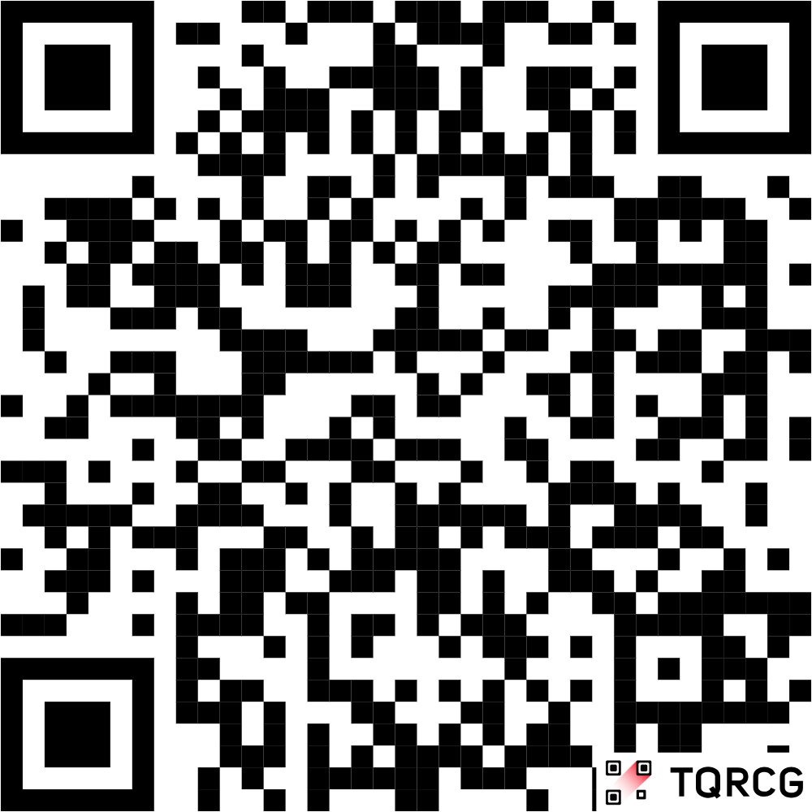
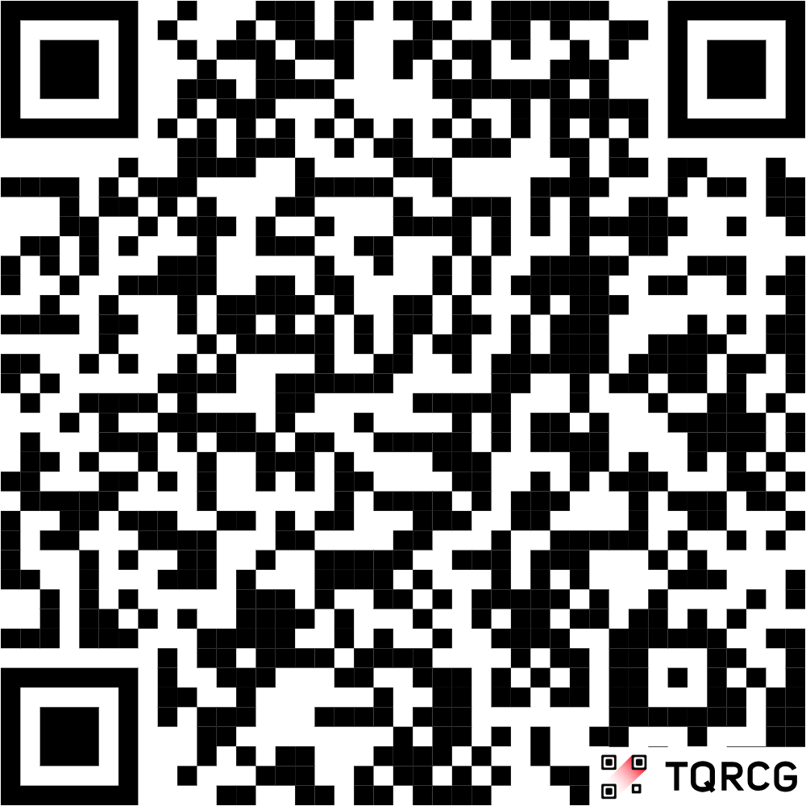

```{r setup, include=FALSE}
knitr::opts_chunk$set(echo = FALSE)
```

## Attendance Survey

**Fill out before the end of section!**

<https://forms.gle/29VqALfCfixsff9d6>

```{r, out.height="0.4\\textheight", fig.align="center"}

```

::: notes
Put at the end of the slides too
:::

## Agenda

1. Attendance Survey
2. Heterogeneous Treatment Effects
3. Midterm Review (Conceptual)
4. Midterm Review (Kahoot)
5. Midterm Review (Quiz)

## Housekeeping

- Problem Set due 11:59 pm on Friday
- Last P-Set went really well!
- Almost done grading proposals...
- Midterm next week

## Heterogeneous Treatment Effects

- "Heterogeneous" = different
    - vs the word "homogeneous" = same
- The general idea:
    - A treatment could have different effects on different groups in terms of magnitude (size of effect)

\vspace{1em}
\small

| Group | Love for Oski before seeing photo | Love for Oski after seeing photo | Difference (after - before) |
|:--|:-:|:-:|:-:|
| Berkeley students | 75% | 100% | +25% |
| Stanford students | 70% | 80% | +10% |

## How to calculate HTEs in R

```{r, echo=TRUE, eval=FALSE}
# Step 1: subset the main dataset to the
# group you want to focus on
cal_students <- subset(data, school == "UCB")

# Step 2: calculate the difference in means on the subset,
# NOT the full dataset
difference_in_means(oski_love ~ saw_photo, cal_students,
                    condition1 = 0, condition2 = 1)
```

## HTEs: Interpretations and Limitations

\small

- Calculating an average treatment effect within a subset/group tells you the average treatment effect within that group
    - i.e. how seeing the picture vs. not seeing the picture affects Berkeley students
- Why can't we say being a Berkeley student instead of a Stanford student causes someone to be more pro-Oski?
    - We don't randomly assign Berkeley vs. Stanford
    - Remember: Causal statements pertain to what we can randomize
    - We can randomize the treatment, but not the characteristics that we choose to base our subsets on
- HTEs just tell us how the treatment effect varies within groups -- they don't suggest that group characteristics cause anything in our outcome

## Midterm Review Concepts

\small

- **Bucket 1:** Reverse Causation, Omitted Variable Bias, Selection Bias
    - How is each term defined? What problems do they each pose for our research? When given an example of a study, how do we identify each type of bias?
- **Bucket 2:** Potential outcomes, Average Treatment Effect, Experiments/Randomization
    - What are potential outcomes? Can we observe them? Why do we calculate an average treatment effect, and how do we calculate it? What is the benefit of randomizing treatment?
- **Bucket 3:** Standard error, t-statistic, p-values, Sample size, Confidence intervals
    - What is noise? How is each term defined, and what is it used for? What values can each statistic take? How do we interpret each statistic?

::: notes
Identify areas of weakness; dig up/review material; teach to others/cement concepts; questions to consider based on the exam
:::

## Studying Tips

- Practice questions to simulate the actual exam
- Use the study guide + go back to previous notes, videos, slides, etc. to recall earlier concepts
    - Concepts + how they relate to each other
- Previous assignments to see how concepts are used in practice
    - Interpreting data

## Kahoot!

The answer key is available in our section's Google Drive folder

## Practice Quiz

<https://berkeley.qualtrics.com/jfe/form/SV_bQ3OrHMdzLLhL4a>

The answer key is in our section's Google Drive folder

*Credit to current GSI Zach Hertz!*

```{r, out.height="0.4\\textheight", fig.align="center"}

```

## Attendance Survey

**Fill out before the end of section!**

<https://forms.gle/29VqALfCfixsff9d6>

```{r, out.height="0.4\\textheight", fig.align="center"}

```

::: notes
Put at the end of the slides too
:::

## Acknowledgements

Special thanks to prior GSIs for providing materials off of which some of these slides are based, especially Ian Castro and Zachary Hertz.
